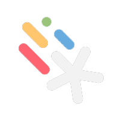

<h1 align="center">Hi, ich bin Timo </h1> 

<h3 align="center">Ein angehender Web- und Software Entwickler aus dem Raum Stuttgart</h3>

🏫 Schulische Repositories: **[`Java`](https://github.com/elpatron18/Java) & [`Web-Programmierung`](https://github.com/elpatron18/MPR)**
 
🔨 Gerade in Arbeit: **[`Minesweeper`](https://github.com/elpatron18/MPR/JavaScript/04_Minesweeper)**

🧠 Gerade lerne ich [`JavaScript`](https://github.com/elpatron18/MPR/JavaScript) und **[Adobe Illustrator](https://www.adobe.com/in/products/illustrator.html)** und ein auf TypeCast Animations-Programm namens [`Motion Canvas`](https://github.com/elpatron18/motion-canvas)

📐 In meiner Freizeit lös ich gerne **[Project Euler](https://projecteuler.net/about)** Aufgaben und gelengentlich **[3D Modellierung / Druck](https://www.autodesk.de/products/fusion-360/)**

---
<h3 align="center">Programme und Tools</h3>

<table align="center">
  <tr>
    <td><h4 align="center">IDEs</h4></td>
    <td><h4 align="center">Adobe</h4></td>
    <td><h4 align="center">Sonstiges</h4></td>
  </tr>
  <tr>
    <td>
      <!-- IntelliJ -->
        
      <!-- PhpStorm -->
        
      <!-- VSC -->
        
      <!-- Eclipse -->
        
    </td>
    <td>
      <!-- Photoshop -->
        
      <!-- Illustrator -->
          
      <!-- InDesign -->
           
      <!-- Premiere Pro -->
         
    </td>
    <td>
      <!-- Notion -->
        
      <!-- Motion Canvas -->
         
      <!-- Fusion360 -->
        
    </td>
  </tr>
</table>
